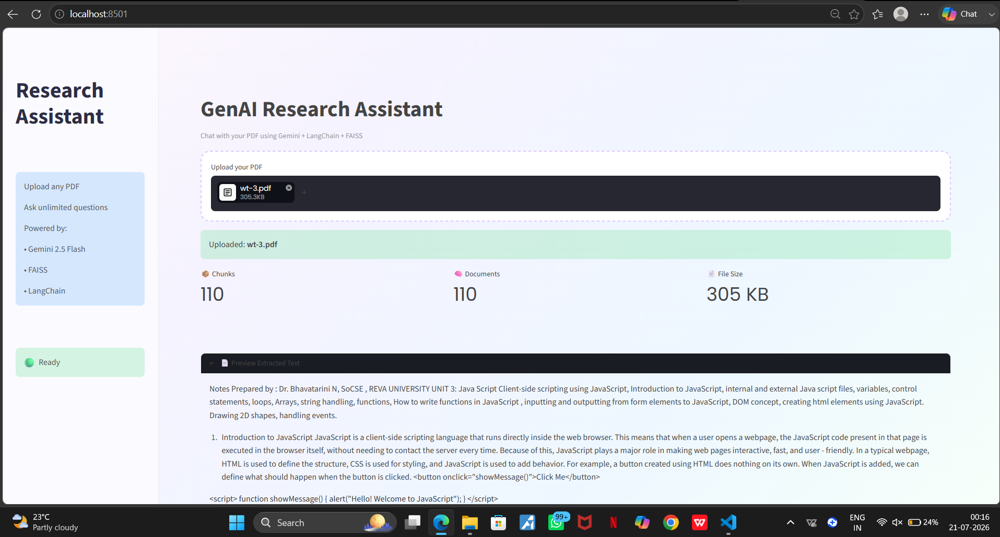
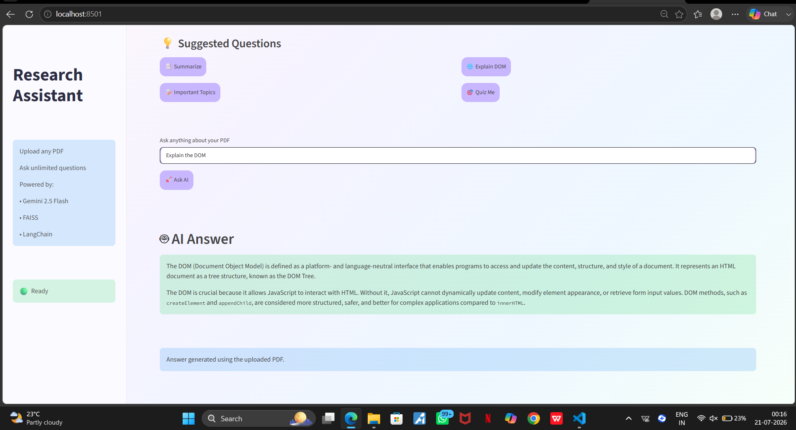

# 📚 DocuMind AI

> An intelligent RAG-powered PDF Research Assistant built using LangChain, FAISS, Hugging Face Embeddings, Google Gemini, and Streamlit.

---

## 🚀 Overview

DocuMind AI allows users to upload PDF documents and interact with them through natural language. Instead of manually searching through lengthy documents, users can ask questions, request summaries, or explore specific topics, and the application retrieves the most relevant information before generating an AI-powered response.

The project implements a complete Retrieval-Augmented Generation (RAG) pipeline, making responses grounded in the uploaded document rather than relying solely on the language model's knowledge.

---

## ✨ Features

- 📄 Upload any PDF document
- 🔍 Automatic text extraction
- ✂️ Intelligent text chunking
- 🧠 Semantic embeddings using Hugging Face
- 📚 FAISS vector database
- 🤖 Google Gemini powered responses
- 💬 Natural language question answering
- 📑 Document summarization
- 🎨 Modern pastel-themed Streamlit interface

---

## 🏗️ Architecture

```text
             PDF Upload
                  │
                  ▼
         Text Extraction
                  │
                  ▼
          Text Chunking
                  │
                  ▼
      HuggingFace Embeddings
                  │
                  ▼
          FAISS Vector Store
                  │
                  ▼
      Similarity Retrieval (RAG)
                  │
                  ▼
        Google Gemini 2.5 Flash
                  │
                  ▼
            AI Generated Answer
```

---

## 🛠️ Tech Stack

| Category | Technology |
|----------|------------|
| Frontend | Streamlit |
| LLM | Google Gemini 2.5 Flash |
| Framework | LangChain |
| Embeddings | Hugging Face Sentence Transformers |
| Vector Database | FAISS |
| PDF Processing | PyPDF |
| Language | Python |

---

## 📸 Screenshots

### Home Page



---

### Upload PDF



---

### Ask Questions


---

### AI Response


---

## ⚙️ Installation

Clone the repository

```bash
git clone https://github.com/YOUR_USERNAME/DocuMind-AI.git
```

Move into the project directory

```bash
cd DocuMind-AI
```

Install dependencies

```bash
pip install -r requirements.txt
```

Create a `.env` file

```env
GOOGLE_API_KEY=YOUR_API_KEY
```

Run the application

```bash
streamlit run app.py
```

---

## 📁 Project Structure

```text
DocuMind-AI/
│
├── app.py
├── requirements.txt
├── README.md
├── .gitignore
│
├── assets/
│   └── style.css
│
├── screenshots/
│   ├── home.png
│   ├── upload.png
│   ├── question.png
│   └── answer.png
│
└── utils/
    ├── chatbot.py
    ├── pdf_reader.py
    ├── retriever.py
    ├── text_splitter.py
    └── vector_store.py
```

---

## 🎯 Future Improvements

- Multi-PDF support
- Conversation memory
- Source citations
- Chat history
- Voice interaction
- OCR support for scanned PDFs
- Document comparison
- Authentication
- Cloud deployment

---

## 👩‍💻 Author

**Shreya J**

Computer Science Engineering Student

AI • Backend Development • Generative AI

GitHub: https://github.com/YOUR_USERNAME

LinkedIn: https://linkedin.com/in/YOUR_LINKEDIN
